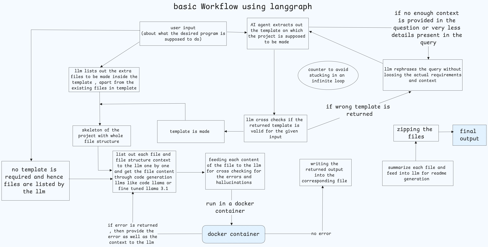
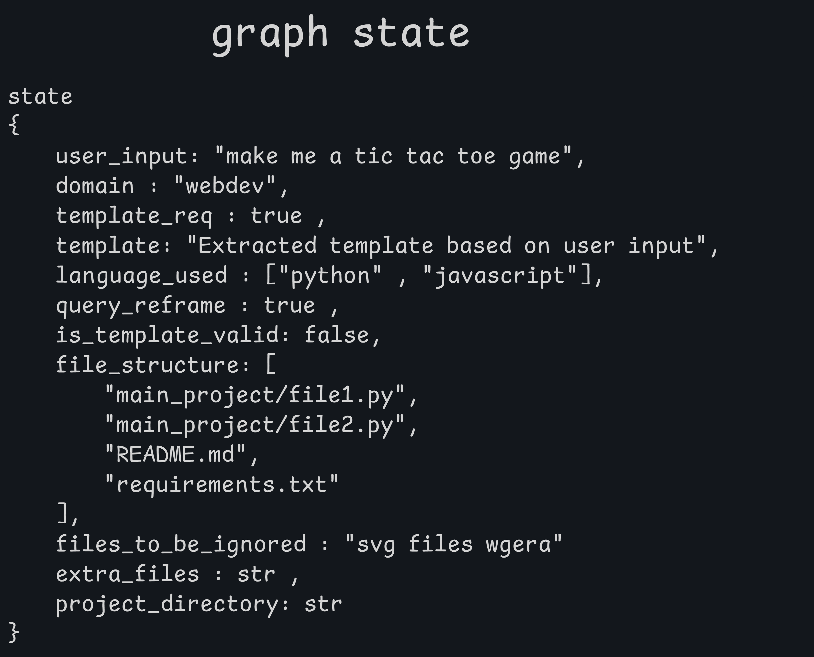

# Codebotica.ai : LangGraph-based Code with predefined Template Generation Workflow

## Overview

This project demonstrates a basic workflow using **LangGraph**, where an LLM (Language Learning Model) assists in generating a project template based on user input. The workflow also ensures that the generated template and code files are valid, free from hallucinations, and optimized to meet user requirements.





## Workflow Process

1. **User Input**:

   - The process starts with the user providing input about what the desired program is supposed to accomplish.
2. **Template Extraction**:

   - The AI agent extracts the template on which the project is supposed to be built.
3. **Template Validation**:

   - The LLM cross-checks whether the returned template is valid for the given input.
   - If the template is invalid or wrong, the LLM rephrases the query while maintaining the context and actual requirements.
   - A counter is in place to avoid getting stuck in an infinite loop of wrong template generation.
4. **File Structure Skeleton Creation**:

   - Once the template is validated, the LLM generates the skeleton of the project with the complete file structure, listing all extra files required inside the template.
5. **File Content Generation**:

   - Each file and its context are listed one by one, and the code generation LLM (e.g., Code Llama or fine-tuned Llama 3.1) is used to create the file contents.
6. **Hallucination and Error Detection**:

   - The content of each file is fed back to the LLM to cross-check for errors or hallucinations in the code or text.
7. **Final Output**:

   - Once validated, the content is written to the corresponding files within the generated project structure.

## Project Structure

The following is a general example of the project structure that the LLM will generate:

```
root/
├── main_project/
│   ├── file1.py
│   ├── file2.py
│   └── ... (other project files)
├── README.md
└── requirements.txt
```

- **main_project/**: Contains the core Python files or other necessary project files.
- **README.md**: Provides an overview and steps to set up the project.
- **requirements.txt**: Contains dependencies for the project.

## Installation

1. Clone this repository:

```bash
git clone https://github.com/sksarvesh007/codebotica.ai.git
cd codebotica.ai
```

2. Install the required packages:

```bash
pip install -r requirements.txt
```

## Usage (nhi bana abhi tak :\\  so ignore the below commands )

1. **Provide Input**: Start by describing the program you want the LLM to generate. The AI will extract the template for you.
2. **Verify the Template**: The LLM will validate the generated template based on your input. If it finds errors, it will rephrase the query and retry.
3. **Generate File Structure**: After validation, the file structure of the project is generated.
4. **Generate and Validate File Content**: The LLM generates content for each file and checks for errors or hallucinations.
5. **Review and Run**: Once the files are written, review the generated code and run the project.

## Features

- **AI-assisted template generation**: Automates the process of creating a project skeleton based on user input.
- **Error and Hallucination Checking**: Ensures that the generated content is valid and free of hallucinations.
- **Loop Prevention**: Counter mechanism avoids infinite loops when the wrong template is repeatedly generated.

## Future Work

- Integration with more advanced LLM models for better context understanding.
- Further automation of the deployment process.

## Contributing

1. Fork the repository.
2. Create a new branch.
3. Make your changes.
4. Submit a pull request.
